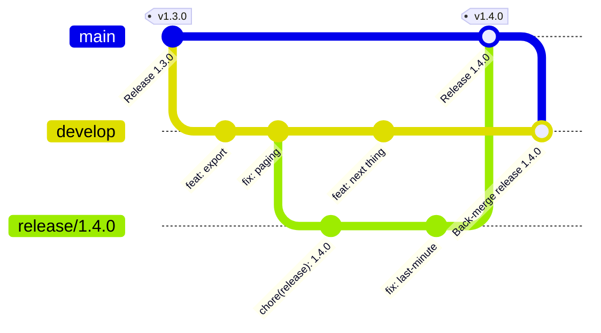
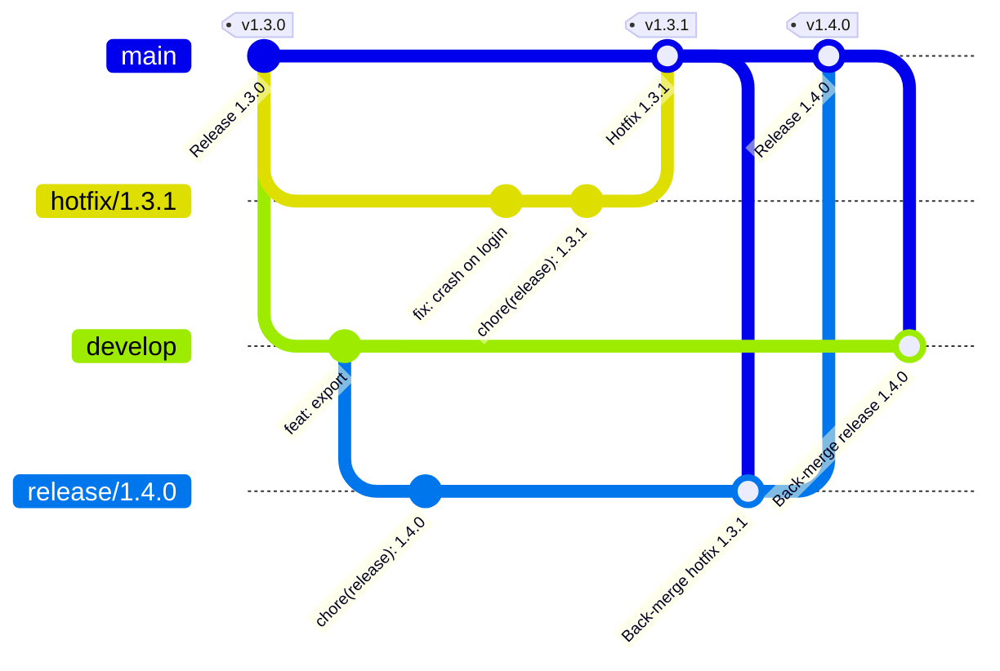

# gitdoctor

[](https://github.com/cagatayuncu/gitdoctor/actions/workflows/ci.yml)
[](https://github.com/cagatayuncu/gitdoctor/releases)
[](LICENSE)

One-command Git Flow for AI coding agents (Claude Code, Cursor, and anything
that can follow a markdown playbook and run bash). Classic git-flow model:
`main` + `develop`, `feature/*`, `release/x.y.z`, `hotfix/x.y.z`, SemVer tags
on main.

**One command each:** start/finish feature, release and hotfix branches; scan
the repo for anomalies (doctor); verify alignment (main↔develop, local↔origin,
version file↔tag); SemVer tagging + CHANGELOG + GitHub Release; and
branch-protection-aware PR/local merging.

## What's inside

| Piece | Role |
|---|---|
| `SKILL.md` | Agent playbook: command routing, gates, dry-run contract, safety rails |
| `scripts/gitflow-doctor.sh` | The only executable: 47 read-only checks + finish probes; JSON, text, Markdown, SARIF or baseline out |
| `references/*.md` | Choreographies (finish release/hotfix/feature, init/start), fix recipes, config schema |
| `adapters/cursor/` | Cursor `/gitdoctor` command wrapper |
| `tests/` | Fixture-based suite: every check has a scratch-repo test; probes and read-only guarantees included |

Design principles:
- **Deterministic checks, agent-driven mutations.** The doctor never writes
  (one sanctioned `git fetch`); the agent performs merges/tags/pushes gated on
  the doctor's JSON.
- **Idempotent finish.** Every finish is a probe walk — rerun after any crash
  or CI wait and it continues from the first missing step. No state files as
  source of truth.
- **Squash-aware.** Content-equivalence via `git merge-tree` catches
  squash-merged branches that ancestry checks miss; gh (when available) is the
  authoritative tier.
- **Protection-aware.** `mergeMode: auto` resolves PR vs local merge per
  target branch from GitHub branch protection.

## Install

Requirements: git ≥ 2.38 recommended (≥ 2.30 works with degraded conflict
prediction), bash (Git Bash on Windows), optional `gh` (authenticated) for
PR mode + GitHub checks. No jq needed.

### Claude Code — as a plugin (recommended)

```
/plugin marketplace add cagatayuncu/claude-plugins
/plugin install gitdoctor@cagatayuncu
```

Then in any repo: `/gitdoctor doctor`, `/gitdoctor start release`,
`/gitdoctor finish`, …

### Claude Code — as a user-level skill

```bash
./install.sh            # or .\install.ps1 on Windows
```

Installs to `~/.claude/skills/gitdoctor/`. Same commands as above.

### Cursor

```bash
./install.sh --cursor-repo /path/to/your/repo
```

Adds `.cursor/commands/gitdoctor.md` (+ the skill payload) to that repo →
`/gitdoctor …` works in Cursor's chat.

## How to use

Talk to your agent with slash commands or plain language: "start a release",
"release aç", "finish this hotfix" route to the same flows. Every mutating
command runs a preflight doctor first and stops on anything unsafe (dirty
worktree, diverged branches, a tag on the wrong commit), so you don't have to
remember the rules yourself.

**1. Once per repo**

```
/gitdoctor init
```

Creates `develop` from `main`, writes `.gitflow.json` with the version files it
detects (`package.json`, `*.csproj`, `pyproject.toml`, `Cargo.toml`,
`VERSION`), sets `CHANGELOG.md merge=union`, offers a first `v0.1.0` tag when
there is none, and recommends branch protection. Re-running it only fixes what
is missing.

**2. Everyday work: features**

```
/gitdoctor start feature login-form   # feature/login-form from a fresh develop, pushed
# ...commit as usual...
/gitdoctor finish                     # run it on the feature branch
```

Finish merges into `develop` (a PR when develop is protected, a `--no-ff`
merge otherwise) and deletes the branch locally and on origin. No tag, no
version change.

Write [conventional commits](https://www.conventionalcommits.org) (`feat:`,
`fix:`, `feat!:` or a `BREAKING CHANGE:` footer). They drive the next version
suggestion and the changelog.

**3. Shipping.** Open a [release](#release-lifecycle) when develop is ready,
a [hotfix](#hotfix-lifecycle) when production is broken.

**4. In between.** `status` for a dashboard, `doctor` for a health check,
`sync` to fast-forward main/develop, `cleanup` for merged branches (it asks
before deleting anything).

**Guarantees**

- **Preview:** `--dry-run` runs every read for real and prints each mutation
  as `DRY-RUN: <argv>` instead of running it.
- **Resume:** `finish` reads its progress from the repo, not from saved state.
  If CI goes red, the network drops or the session dies halfway, run
  `/gitdoctor finish` again: it re-probes and continues from the first missing
  step.
- **PR or local merge, per target branch:** with `mergeMode: auto` (default) a
  protected target gets a PR and an unprotected one a local `--no-ff` merge.
  A release can reach `main` by PR and go back to `develop` locally. Force
  either with `"mergeMode": "pr"` or `"local"`.
- **Nothing destructive unasked:** no force-push to `main`, `develop` or tags,
  no silent resolution of source-file conflicts. Deleting anything beyond the
  flow's own branch, and `gh pr merge --admin`, happen only when you ask.

## Commands

| Command | What it does |
|---|---|
| `/gitdoctor init` | Create develop, write `.gitflow.json`, changelog merge=union, protection advice |
| `/gitdoctor start feature <name>` | Preflight → branch from develop |
| `/gitdoctor start release [x.y.z]` | Version suggestion from conventional commits → branch from develop |
| `/gitdoctor start hotfix [x.y.z]` | Branch from main, collision guards |
| `/gitdoctor finish` | Detect branch type → merge (PR or local) + tag + GitHub Release + back-merge + cleanup; resumable. `--abort` (release/hotfix, before the merge to main), `--admin` (bypass required checks, explicit only) |
| `/gitdoctor doctor` | Full anomaly/alignment scan with fix recipes |
| `/gitdoctor sync` | fetch --prune + fast-forward main/develop |
| `/gitdoctor status` | Branch, ahead/behind, open PRs, latest tag, next version |
| `/gitdoctor cleanup` | Merged/stale branch cleanup (confirmed) |
| `/gitdoctor explain <check-id>` | Print the fix recipe for one check (CLI: `--explain <id>`) |
| `/gitdoctor baseline` | Adopt today's findings as `doctor.ignoreFindings` entries — only new ones stay loud |

Add `--dry-run` to any mutating command: reads run, every mutation is printed
as `DRY-RUN: <argv>` instead of executed.

## Release lifecycle

A release freezes what is on `develop`, gives it a version and ships it to
`main`. Features that land meanwhile wait for the next one.



### Open a release

```
/gitdoctor start release          # suggests the version
/gitdoctor start release 1.4.0    # or name it
```

1. **Preflight.** Refused while another release is open
   (`release.maxConcurrent`, default 1).
2. **Version.** Without an argument, the next version comes from the
   conventional commits since the latest tag: a breaking change → major, else
   any `feat:` → minor, else patch. You see it as
   `v1.3.0 → v1.4.0 (3 feats, 5 fixes, 0 breaking)` and accept or override. It
   must be greater than the latest tag; prerelease suffixes need
   `release.allowPrerelease`.
3. **Branch.** `release/1.4.0` is cut from an up-to-date `develop` and pushed.
4. **Bump now or at finish.** You are offered the version-file bump and the
   changelog section right away, which makes the release branch reviewable.
   Decline and finish does it as its first step.

While it is open, only stabilization fixes go onto `release/1.4.0`. The doctor
reports develop moving ahead as informational (`release-develop-drift`) and
predicts back-merge conflicts before finish day.

### Close a release

Run `/gitdoctor finish` on `release/1.4.0`. The version comes from the branch
name and is never asked again. Finish walks these steps in order, skipping
every step the probe already sees done:

| Step | What happens |
|---|---|
| `version-bumped` | Version files set to `1.4.0`, changelog section prepended, `chore(release): 1.4.0` committed and pushed |
| `merged-to-main` | Local mode: `git merge --no-ff` into main, not pushed yet. PR mode: opens or reuses the PR to main, waits for checks, merges |
| `tag-exists` | Annotated `v1.4.0` on the merge commit. In PR mode that is the PR's `mergeCommit`, never a local sha |
| `tag-pushed` | Local mode: `git push --atomic origin main refs/tags/v1.4.0`, so main and the tag land together or not at all. PR mode: the tag alone |
| `back-merged` | The **tag** is merged into `develop`, making main an ancestor of develop. Directly, or through a `backmerge/release-1.4.0` PR when develop is protected |
| `remote-branch-deleted`, `local-branch-deleted` | `release/1.4.0` removed. `-D` only after gh confirms the PR merged |
| `gh-release` | GitHub Release `v1.4.0` with the changelog section as notes, created on the existing tag (gh never creates the tag) |
| `homebrew-formula` | Only when `homebrew` is configured: the tap formula's `url` and `sha256` moved to the new tag |

A post-flight re-probe and quick doctor confirm nothing was left behind, and
you get the version, tag sha, PR links and release URL.

**Back-merge conflicts** are predicted with `git merge-tree` before the merge.
Version files resolve to the higher version and the changelog keeps both
sides. Source files are never auto-resolved: you are walked through them, or
the merge is aborted cleanly and the next `finish` resumes at that step.

**When it doesn't go straight through**

- **Red CI on the PR:** finish stops and names the failing checks (it can
  queue `gh pr merge --auto` if you want merge-on-green). Fix on the release
  branch, then run `/gitdoctor finish` again.
- **Interrupted anywhere:** run `/gitdoctor finish` again. Done steps are
  skipped.
- **Abort:** `/gitdoctor finish --abort` works only until the release is
  merged into main. It closes the PR and keeps the branch. After the merge to
  main, the only way out is forward. Run `/gitdoctor doctor` right after
  abandoning a release: `missing-back-merge` catches hotfix commits that would
  otherwise never reach develop.

## Hotfix lifecycle

A hotfix patches what is already released, so it starts from `main`, not
`develop`. With a release open, the fix reaches develop through that release;
with none open, it is back-merged into develop directly.



### Open a hotfix

```
/gitdoctor start hotfix           # suggests latest tag + patch
/gitdoctor start hotfix 1.3.1     # or name it
```

1. **Preflight.** The base is always `main`; the doctor flags a hotfix cut
   from anywhere else (`wrong-base-hotfix`).
2. **Version.** Suggested as a patch bump of the latest tag. It must be
   greater than the latest tag **and** lower than any open release: with
   `release/1.4.0` open and `v1.3.0` latest, the hotfix is `1.3.1`, never
   `1.4.x`.
3. **Branch.** `hotfix/1.3.1` from an up-to-date `main`, pushed. Commit the fix
   there.

### Close a hotfix

Run `/gitdoctor finish` on `hotfix/1.3.1`. It is the release finish step for
step (version bump, merge to main, `v1.3.1` tag, push, branch cleanup, GitHub
Release, Homebrew), just as resumable, and `--abort` has the same rule. The
difference is where the fix goes back to in `back-merged`:

| Open releases | Back-merge target |
|---|---|
| none | `develop` |
| exactly one | that `release/*` branch, which carries the fix to develop at its own finish |
| more than one | finish stops and asks which release takes it |

A release counts as open while it still has something to ship: its tag does
not exist yet, or its tip is not in main. A tagged, merged `release/*` branch
is a leftover from a completed finish; it doesn't count (the doctor lists it
as `orphaned-release-branch` for cleanup).

**Urgent and CI is slow?** `/gitdoctor finish --admin` merges the hotfix PR
with `gh pr merge --admin`, skipping the wait. Only when you type it; it is
never the default.

## Integrations

The doctor's JSON output + exit codes plug into anything: a **GitHub Actions
PR bot** (live on this repo — one self-updating comment per PR, criticals
block the merge), a scheduled scan that files an issue, client `pre-push` and
server `pre-receive` hooks (both covered by the fixture suite), a
[pre-commit](https://pre-commit.com) hook definition, SARIF output for GitHub
code scanning, a cron watcher for repos with no CI, and GitLab/Bitbucket
drafts. See [integrations/](integrations/README.md).

## The doctor

```bash
bash scripts/gitflow-doctor.sh --format json          # everything (agent contract)
bash scripts/gitflow-doctor.sh --format text          # for humans; also: markdown, sarif, baseline
bash scripts/gitflow-doctor.sh --checks missing-back-merge,tag-unpushed
bash scripts/gitflow-doctor.sh --explain missing-back-merge   # the fix recipe, in the terminal
bash scripts/gitflow-doctor.sh --list-checks
bash scripts/gitflow-doctor.sh --probe finish-release --branch release/1.2.0 --version 1.2.0
```

Exit codes: 0 clean, 1 warnings, 2 criticals, 4 usage error. 47 checks across environment,
worktree, local↔origin sync, git-flow topology (missing back-merge, wrong
base, orphaned/colliding releases), tags (unpushed, sha-mismatch, duplicates,
lightweight, unsigned), release bookkeeping (version files and changelog vs
the latest tag), branch hygiene (stale/squash-merged), and GitHub (protection
on main and develop, wrong-base PRs, squash-only limitations, tags without a
Release), and distribution (a Homebrew tap formula lagging the latest tag). Every finding names what it is about (`key`), so
`doctor.ignoreFindings` can silence one branch or tag instead of a whole check,
and `--format baseline` writes those entries for you. Full catalog with
recipes: [references/fix-recipes.md](references/fix-recipes.md).

Configuration: [.gitflow.json reference](references/config.md) — add
`"$schema": "https://raw.githubusercontent.com/cagatayuncu/gitdoctor/main/schema/gitflow.schema.json"`
for editor completion ([schema/gitflow.schema.json](schema/gitflow.schema.json)).

## Tests

```bash
bash tests/run-tests.sh            # all (JOBS=8 parallel by default)
bash tests/run-tests.sh t/doctor/T030-missing-back-merge.sh
```

Every check id has a fixture that creates the anomaly in a scratch repo
(fake `git init --bare` origin), asserts the finding, applies the recipe, and
asserts it clears. gh-dependent checks run against a canned-response `gh`
stub. CI runs the suite on ubuntu, macOS (bash 3.2) and windows (Git Bash)
plus shellcheck.

Note for Windows: per-process antivirus scanning can make git spawns slow;
excluding your repos directory and `git.exe` from real-time scanning speeds
up both the doctor and the tests dramatically.

## Not in v1 (deliberate)

`support/*` maintenance branches, rc/prerelease tags in the release flow,
monorepo multi-package versioning, GitLab/Bitbucket, jsonpath-precise version
file editing.
